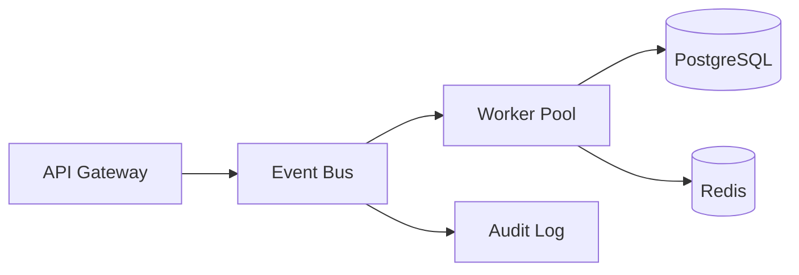

# PROFILE DESIGN GUIDE
## Ankit Raj — GitHub Engineering Profile

---

## 01. REPOSITORY SETUP

Your GitHub profile README lives in a special repository:

```
github.com/ankitraj5ar/ankitraj5ar
```

Create a public repo named exactly **`ankitraj5ar`** (matching your username).
Add `README.md` to the root. GitHub auto-renders it as your profile.

### Folder structure

```
ankitraj5ar/
├── README.md
└── assets/
    ├── banner.svg          ← hero banner (provided)
    └── divider.svg         ← section separator (provided)
```

Commit both SVG files to `assets/` and the README references them
as `./assets/banner.svg` — GitHub renders them inline.

---

## 02. COLOR PALETTE

The entire profile is optimized for GitHub dark mode.

| Role             | Value      | Usage                              |
|------------------|------------|------------------------------------|
| Background       | `#0d0d0d`  | SVG backgrounds, widget bg         |
| Surface          | `#111111`  | Cards, code block bg               |
| Border           | `#1a1a1a`  | Lines, separators, rules           |
| Text primary     | `#f0f0f0`  | Name, headings                     |
| Text secondary   | `#888888`  | Body text, stats                   |
| Text muted       | `#333333`  | Decorative right-column tags       |
| Accent green     | `#22c55e`  | Status dot only — use sparingly    |
| Accent dim       | `#444444`  | Icons in stats widgets             |

**Rule:** The accent green should appear exactly once — the `OPERATIONAL` status dot.
It creates maximum impact through scarcity. Add more green and it loses its weight.

---

## 03. TYPOGRAPHY

GitHub README renders markdown with its own font stack. You cannot inject
custom fonts into the rendered view. Work with what GitHub provides:

- **Body prose** — GitHub's default sans (Segoe UI / SF Pro / system)
- **Code blocks** — GitHub's default monospace (SFMono / Consolas / Menlo)

**Strategy:** Use code blocks strategically, not just for code. The stack
section, runtime section, and philosophy section are all inside ` ``` ` blocks,
giving them monospace rendering that feels engineered and terminal-adjacent.

In SVGs, you control fonts. The banner uses:
- `'Arial Black', 'Helvetica Neue', Arial, sans-serif` — bold display
- `'Courier New', Courier, monospace` — role label and status text

These are universally available and render correctly in GitHub's SVG renderer,
which does **not** load external fonts. Never use Google Fonts in SVGs hosted on GitHub.

---

## 04. BANNER DESIGN BREAKDOWN

The banner (`assets/banner.svg`) uses these intentional decisions:

**Name treatment**
- 80px, font-weight 900, letter-spacing -4 — tight, authoritative, architectural
- Color `#f0f0f0` — slightly off-white, not pure white (less harsh)

**Right column tags**
- Color `#222222` — almost invisible, creates depth without noise
- They reward close reading without demanding attention on first glance
- Spacing: letter-spacing 3 — gives them a technical, tag-like feel

**Dot grid**
- Opacity 0.07 — extremely subtle, adds texture without drawing the eye
- Placed top-right only — asymmetric, not wallpaper-like

**Vertical accent rule**
- 1px line at x=64, from y=56 to y=210
- Creates a structural column edge. The name and role start at x=88, giving 24px breathing room from the rule

**Green status dot**
- Only color in the entire SVG besides grayscale
- Communicates availability without saying "Open to work"

---

## 05. GITHUB WIDGET CONFIGURATION

### Stats card
```
https://github-readme-stats.vercel.app/api?username=ankitraj5ar
  &show_icons=true
  &hide_border=true
  &bg_color=0d0d0d
  &title_color=f0f0f0
  &text_color=444444
  &icon_color=333333
  &count_private=true
  &hide_title=true
  &rank_icon=percentile
```

### Languages card
```
https://github-readme-stats.vercel.app/api/top-langs/?username=ankitraj5ar
  &layout=compact
  &hide_border=true
  &bg_color=0d0d0d
  &title_color=f0f0f0
  &text_color=444444
  &langs_count=6
  &hide_title=true
```

### Contribution graph
```
https://github-readme-activity-graph.vercel.app/graph?username=ankitraj5ar
  &bg_color=0d0d0d
  &color=333333
  &line=1e1e1e
  &point=444444
  &hide_border=true
  &area=true
  &area_color=1a1a1a
```

**Key principle:** All three widgets use matching dark backgrounds.
They feel like one system, not three third-party embeds.

---

## 06. SUBTLE ANIMATION IDEAS

GitHub sanitizes `<animate>` and CSS animations inside SVGs rendered as `` tags.
**Exception:** SVGs rendered via `` can use CSS animations
if the SVG has a `<style>` block internally — but GitHub strips them.

**Workaround:** Use a `.svg` with animation and link it to a raw GitHub URL,
or use services that generate animated SVGs:

### Option A — Typing animation for hero subtitle
```
https://readme-typing-svg.demolab.com?font=JetBrains+Mono&size=14
  &duration=3000&pause=4000
  &color=333333
  &background=0D0D0D00
  &center=true
  &vCenter=true
  &width=500
  &lines=distributed+systems+%C2%B7+event-driven+architecture
```
This adds a subtle typewriter effect to a secondary line. Use sparingly —
one animated element maximum.

### Option B — Snake animation on contribution grid
GitHub supports a contribution snake animation via GitHub Actions:

```yaml
# .github/workflows/snake.yml
name: Generate Snake
on:
  schedule:
    - cron: "0 0 * * *"
  workflow_dispatch:
jobs:
  snake:
    runs-on: ubuntu-latest
    steps:
      - uses: Platane/snk@v3
        with:
          github_user_name: ankitraj5ar
          outputs: |
            dist/snake-dark.svg?palette=github-dark
```

Then reference `./dist/snake-dark.svg` in the README.
This is subtle, elegant, and shows your contribution pattern as a living visualization.

### Option C — No animation (recommended)
The profile is designed to communicate **calm confidence**. Animation risks
reading as anxious or generic. The restraint is the statement.

---

## 07. ADVANCED GITHUB MARKDOWN TRICKS

### `<details>` for collapsible architecture notes
```markdown
<details>
<summary><code>deeper system notes</code></summary>
<br/>

Things I think about when designing systems:

- Idempotency is not optional. Every mutating operation needs a safe retry story.
- The outbox pattern is underused. Direct dual-write to a queue is a bug waiting to happen.
- Schema evolution is a first-class concern, not a migration afterthought.
- A consumer that can't be paused without data loss is a liability.

</details>
```

This hides secondary content from the primary scan, keeping the profile
clean for first-time visitors while rewarding deeper readers.

### `<kbd>` for keyboard/system aesthetic
Renders as raised buttons — useful for tech tags without using badges:
```markdown
<kbd>Go</kbd> <kbd>Kafka</kbd> <kbd>PostgreSQL</kbd>
```

### Invisible spacers via `<br/>`
GitHub renders `<br/>` for vertical rhythm. Use 2 `<br/>` between major sections
for visual breathing room.

### Centered image pairs with `&nbsp;&nbsp;`
```html

&nbsp;&nbsp;

```
`&nbsp;&nbsp;` creates a small gap. Match `height` on both to align baselines.

### Horizontal rule `---`
Standard `---` renders as a clean `<hr>`. It's the simplest, most elegant separator.
It respects dark/light mode automatically. Don't overthink it.

---

## 08. ARCHITECTURE-THEMED VISUALS

### System topology diagram (optional future addition)
Consider a minimal SVG showing a simplified architecture of one of your systems:
- Boxes for services (kafka, api gateway, workers, DB)
- Thin arrows for data flow
- Monochrome: grays only
- No colors except one accent on the "hot path"

This communicates systems thinking visually, without words.

### Mermaid diagram support
GitHub renders Mermaid natively in markdown:

````markdown

````

Keep it small, left-to-right, minimal labels. This is architecture documentation
as profile element — genuinely rare and impressive.

### ASCII architecture (terminal aesthetic)
Inside a code block:
```
┌─ api gateway ──────────────────────────────────────────┐
│                                                        │
│  POST /events ──► kafka topic ──► consumer group       │
│                                      │                 │
│                               ┌──────┴──────┐          │
│                         worker-1        worker-2       │
│                               │                        │
│                          postgresql                     │
└────────────────────────────────────────────────────────┘
```

---

## 09. MAKING THE PROFILE TRULY UNIQUE

Most engineers either have empty profiles or noisy ones. The middle path —
a thoughtful, minimal, engineering-first profile — is genuinely rare.

**Specific differentiators:**

1. **The runtime section** — treating your current state as a live system status
   feels more alive than a static bio. Update it quarterly.

2. **Philosophy in a code block** — stating engineering values in `key > value`
   format is memorable and communicates how you think, not just what you know.

3. **Project descriptions focused on design decisions** — "why" over "what".
   Most devs describe what their project does. You describe what it's *designed for*
   and what tradeoffs it makes. That signals engineering maturity.

4. **Domain knowledge taxonomy** — listing "Consumer group coordination",
   "at-least-once delivery", "outbox pattern" signals depth without showing code.
   Recruiters and engineers both notice this.

5. **The green dot as the only color** — this visual restraint is memorable.
   It communicates "this person makes intentional choices."

6. **No "passionate developer" text** — zero instances of words like
   "passionate", "enthusiastic", "love to code". These are filtering signals.

---

## 10. MAINTENANCE PROTOCOL

Update the `current runtime` section every quarter. The fields to refresh:

```
building   ──  [what you're actively shipping]
exploring  ──  [what you're learning right now]
reading    ──  [current technical reading]
```

This keeps the profile alive without requiring a full redesign.
It also signals that you're actively evolving — not a static resume.

---

## SUMMARY

```
design philosophy   minimal · spacious · intentional · engineered
color palette       monochrome dark · single accent green
typography          system fonts · monospace for code sections
animations          none (recommended) · optional snake grid
widgets             github-readme-stats · activity graph (dark-matched)
unique signals      runtime section · philosophy block · domain taxonomy
update cadence      quarterly (runtime section only)
```

---

*The profile should feel like documentation for a system that happens to be a person.*
