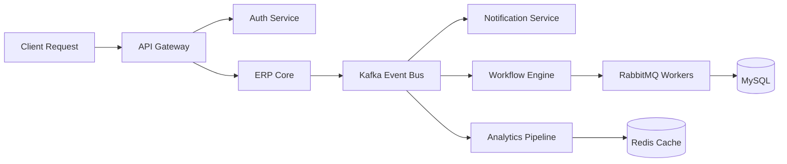

<div align="center">

# ⚡ SYSTEM.INIT()


<br/>
<br/>


</div>

---

# 🧠 WHO_AM_I

```bash
> whoami

Ankit Raj

Software Engineer obsessed with distributed systems,
message orchestration, backend scalability,
and real-world production architecture.

I don't just build APIs.
I engineer systems that survive concurrency,
network failures, retries, scale, and chaos.
```

---

# ⚙️ SYSTEM.DESIGN()

<div align="center">



</div>

---

# 🚀 TECH_STACK.EXE

<div align="center">


</div>

<br/>

<div align="center">

| Backend   | Architecture         | Infrastructure | Messaging        |
| --------- | -------------------- | -------------- | ---------------- |
| PHP       | Microservices        | Docker         | Kafka            |
| Node.js   | Event-Driven Systems | Linux          | RabbitMQ         |
| Go        | Multi-Tenant ERP     | CI/CD          | Queue Workers    |
| REST APIs | CQRS                 | Scaling        | Async Processing |

</div>

---

# 🛰️ ENGINEERING.PHILOSOPHY

<div align="center">

```txt
Good engineering is invisible.
Users should never notice the retries,
failovers, queues, deadlocks, race conditions,
or the chaos your system survived.
```

</div>

---

# 📊 LIVE_METRICS

<div align="center">


<br/>


</div>

---

# 🧪 CURRENT.EXPERIMENTS

```go
package main

func main() {

    BuildDistributedSystems()

    ScaleERP()

    LearnKafkaInternals()

    OptimizeDatabaseQueries()

    DesignFaultTolerance()

    AutomateEverything()
}
```

---

# 🔥 ACTIVE_INTERESTS

<div align="center">

<table>
<tr>
<td width="33%">

### ⚡ Backend

- High Performance APIs
- Workflow Engines
- Queue Systems
- Authentication
- ERP Architecture

</td>
<td width="33%">

### 🧠 System Design

- CQRS
- Event Sourcing
- Distributed Transactions
- Idempotency
- Fault Tolerance

</td>
<td width="33%">

### ☁️ Infrastructure

- Docker
- Scaling
- Observability
- Logging
- Service Communication

</td>
</tr>
</table>

</div>

---

# 🌌 DIGITAL_FOOTPRINT

<div align="center">

<a href="https://github.com/ankitraj5ar">

</a>

<a href="https://www.linkedin.com/in/ankitraj5ar">

</a>

<a href="mailto:ankitraj5ar@gmail.com">

</a>

</div>

---

# 🧬 SYSTEM.STATUS

```yaml
SYSTEM STATUS: ONLINE
ARCHITECTURE: DISTRIBUTED
SCALABILITY: ENABLED
FAILURE MODE: HANDLED
QUEUE SYSTEM: ACTIVE
UPTIME: ∞
```

---

<div align="center">


</div>
