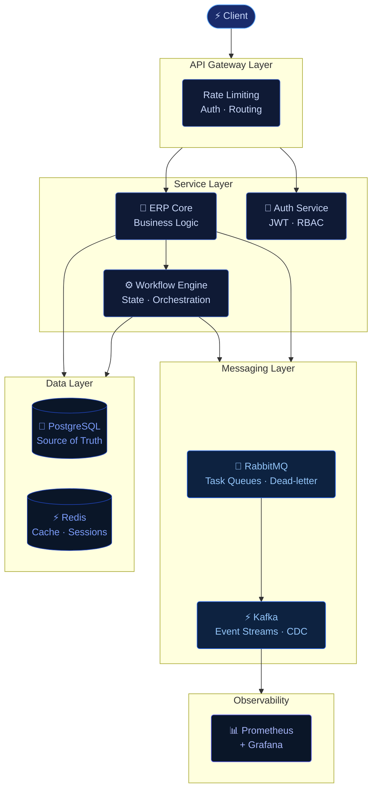

<!-- ============================================================
     ANKIT RAJ — GitHub Profile README
     Inspired by: ankitraj5ar.online
     Color Palette: Deep Navy #0A0F1E → Indigo #1A2B6B | Accent #58A6FF
     ============================================================ -->

<!-- ─── HEADER BANNER ─── -->
<div align="center">


</div>

<!-- ─── TYPING ANIMATION ─── -->
<div align="center">

[](https://github.com/ankitraj5ar)

</div>

<br/>

---

<!-- ─── STATEMENT ─── -->

<div align="center">

*The measure of a system is not how it performs at launch —*<br/>
*but whether it holds under the load you never planned for.*

</div>

---

<br/>

<!-- ─── ABOUT ─── -->

```yaml
# engineer.yml

name    : Ankit Raj
role    : Software Engineer — Backend & Distributed Systems
exp     : 3+ years designing APIs, ERP platforms, event-driven systems

focus:
  - Multi-tenant ERP infrastructure
  - Event-driven architecture with Kafka & RabbitMQ
  - Distributed system design and reliability
  - Workflow orchestration across complex business domains

mindset : Correctness first. Performance where it matters. Simplicity where it's earned.
status  : open to the right opportunity
```

<br/>

---

<!-- ─── ARCHITECTURE DIAGRAM ─── -->

<div align="center">

### How I think about systems

</div>



<br/>

---

<!-- ─── TECH STACK ─── -->

<div align="center">

### Tech I work with

[](https://ankitraj5ar.online)

</div>

<br/>

---

<!-- ─── GITHUB ANALYTICS ─── -->

<div align="center">

### GitHub Analytics


&nbsp;


<br/><br/>


</div>

<br/>

---

<!-- ─── CONNECT ─── -->

<div align="center">

[](https://ankitraj5ar.online)
&nbsp;
[](https://linkedin.com/in/ankitraj5ar)
&nbsp;
[](mailto:ankitraj5ar@gmail.com)

</div>

<br/>

<!-- ─── FOOTER ─── -->
<div align="center">


</div>
