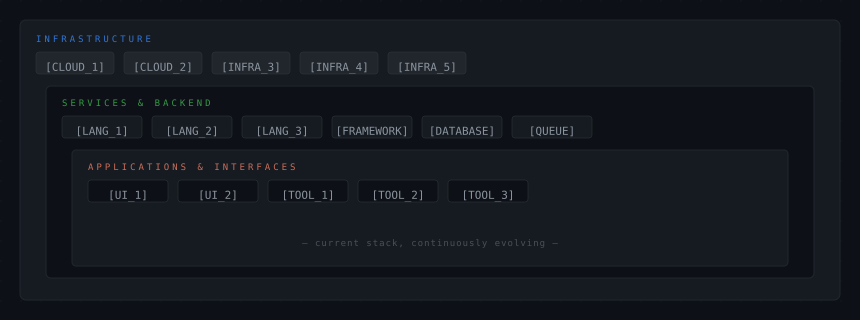

<!-- ============================================================
     GITHUB PROFILE README
     Design System: Signal Terminal
     Aesthetic: Distributed Systems Console · Minimalist Engineering
     ============================================================ -->

<div align="center">


</div>

<br/>

<!---------------------------------------------------------------------------->
<!-- IDENTITY BLOCK                                                          -->
<!---------------------------------------------------------------------------->

<table width="100%" border="0" cellspacing="0" cellpadding="0">
<tr>
<td width="60%" valign="top">

```
╔═══════════════════════════════════════════╗
║  [YOUR_NAME]                              ║
║  [YOUR_TITLE]                             ║
╠═══════════════════════════════════════════╣
║                                           ║
║  focus    →  [PRIMARY_DOMAIN]             ║
║  building →  [CURRENT_MISSION]            ║
║  thinking →  [PHILOSOPHY_ONE_LINE]        ║
║  located  →  [CITY, COUNTRY]              ║
║                                           ║
╚═══════════════════════════════════════════╝
```

</td>
<td width="40%" valign="top" align="right">


</td>
</tr>
</table>

<br/>

---

<!---------------------------------------------------------------------------->
<!-- ABOUT — a paragraph, not a list                                        -->
<!---------------------------------------------------------------------------->

<div align="center">
<sub><kbd>&nbsp;&nbsp;ABOUT&nbsp;&nbsp;</kbd></sub>
</div>

<br/>

> [!NOTE]
> [A one-sentence thesis about how you think about engineering — not what you do, but how you do it. Make it specific and un-generic. Example: *I treat software as infrastructure — designed for operators, not just users.*]

[PARAGRAPH_1: 2-3 sentences about your engineering philosophy or the kinds of problems you gravitate toward. Avoid "I am passionate about". Instead, describe the shape of work that energizes you.]

[PARAGRAPH_2: 1-2 sentences about what you're currently exploring, building, or thinking about. This should be concrete — a system, a technique, a question you're sitting with.]

<br/>

---

<!---------------------------------------------------------------------------->
<!-- STACK — architecture layer diagram                                     -->
<!---------------------------------------------------------------------------->

<div align="center">
<sub><kbd>&nbsp;&nbsp;ARCHITECTURE&nbsp;&nbsp;</kbd></sub>
</div>

<br/>

<div align="center">

</div>

<br/>

---

<!---------------------------------------------------------------------------->
<!-- ACTIVE PROCESSES — what's running right now                            -->
<!---------------------------------------------------------------------------->

<div align="center">
<sub><kbd>&nbsp;&nbsp;ACTIVE PROCESSES&nbsp;&nbsp;</kbd></sub>
</div>

<br/>

<table width="100%" border="0">
<thead>
<tr>
<th align="left"><sub>STATUS</sub></th>
<th align="left"><sub>PROJECT</sub></th>
<th align="left"><sub>DESCRIPTION</sub></th>
<th align="right"><sub>STACK</sub></th>
</tr>
</thead>
<tbody>
<tr>
<td><code>● ACTIVE</code></td>
<td><a href="[PROJECT_1_LINK]"><b>[PROJECT_1_NAME]</b></a></td>
<td><sub>[PROJECT_1_ONE_LINE_DESCRIPTION]</sub></td>
<td align="right"><sub>[TECH] · [TECH]</sub></td>
</tr>
<tr>
<td><code>● ACTIVE</code></td>
<td><a href="[PROJECT_2_LINK]"><b>[PROJECT_2_NAME]</b></a></td>
<td><sub>[PROJECT_2_ONE_LINE_DESCRIPTION]</sub></td>
<td align="right"><sub>[TECH] · [TECH]</sub></td>
</tr>
<tr>
<td><code>◐ BUILDING</code></td>
<td><a href="[PROJECT_3_LINK]"><b>[PROJECT_3_NAME]</b></a></td>
<td><sub>[PROJECT_3_ONE_LINE_DESCRIPTION]</sub></td>
<td align="right"><sub>[TECH] · [TECH]</sub></td>
</tr>
<tr>
<td><code>○ PLANNED</code></td>
<td><b>[PROJECT_4_NAME]</b></td>
<td><sub>[PROJECT_4_ONE_LINE_DESCRIPTION]</sub></td>
<td align="right"><sub>[TECH]</sub></td>
</tr>
</tbody>
</table>

<br/>

---

<!---------------------------------------------------------------------------->
<!-- NOTABLE BUILDS — significant shipped work                              -->
<!---------------------------------------------------------------------------->

<div align="center">
<sub><kbd>&nbsp;&nbsp;NOTABLE BUILDS&nbsp;&nbsp;</kbd></sub>
</div>

<br/>

<table width="100%" border="0">
<tr>

<td width="50%" valign="top">

### `[BUILD_1_NAME]`

<sub>[BUILD_1_SYSTEM_DESCRIPTION] — a [BUILD_1_WHAT_IT_IS] designed for [BUILD_1_WHO_OR_WHAT].</sub>

<br/>

<sub>
`[TECH]` &nbsp; `[TECH]` &nbsp; `[TECH]`
</sub>

<br/>

<a href="[BUILD_1_LINK]"><sub>→ view project</sub></a> &nbsp;&nbsp; <a href="[BUILD_1_DOCS_LINK]"><sub>→ documentation</sub></a>

</td>

<td width="50%" valign="top">

### `[BUILD_2_NAME]`

<sub>[BUILD_2_SYSTEM_DESCRIPTION] — a [BUILD_2_WHAT_IT_IS] designed for [BUILD_2_WHO_OR_WHAT].</sub>

<br/>

<sub>
`[TECH]` &nbsp; `[TECH]` &nbsp; `[TECH]`
</sub>

<br/>

<a href="[BUILD_2_LINK]"><sub>→ view project</sub></a> &nbsp;&nbsp; <a href="[BUILD_2_DOCS_LINK]"><sub>→ documentation</sub></a>

</td>

</tr>
<tr>

<td width="50%" valign="top">

### `[BUILD_3_NAME]`

<sub>[BUILD_3_SYSTEM_DESCRIPTION] — a [BUILD_3_WHAT_IT_IS] for [BUILD_3_WHO_OR_WHAT].</sub>

<br/>

<sub>
`[TECH]` &nbsp; `[TECH]` &nbsp; `[TECH]`
</sub>

<br/>

<a href="[BUILD_3_LINK]"><sub>→ view project</sub></a>

</td>

<td width="50%" valign="top">

### `[BUILD_4_NAME]`

<sub>[BUILD_4_SYSTEM_DESCRIPTION] — [BUILD_4_WHAT_IT_IS] that [BUILD_4_KEY_CAPABILITY].</sub>

<br/>

<sub>
`[TECH]` &nbsp; `[TECH]` &nbsp; `[TECH]`
</sub>

<br/>

<a href="[BUILD_4_LINK]"><sub>→ view project</sub></a>

</td>

</tr>
</table>

<br/>

---

<!---------------------------------------------------------------------------->
<!-- SYSTEM TELEMETRY — GitHub stats                                        -->
<!---------------------------------------------------------------------------->

<div align="center">
<sub><kbd>&nbsp;&nbsp;SYSTEM TELEMETRY&nbsp;&nbsp;</kbd></sub>
</div>

<br/>

<div align="center">
<table border="0" cellspacing="0" cellpadding="0">
<tr>
<td>

</td>
<td>

</td>
</tr>
</table>
</div>

<br/>

---

<!---------------------------------------------------------------------------->
<!-- WRITING / THINKING — optional blog / notes section                    -->
<!---------------------------------------------------------------------------->

<div align="center">
<sub><kbd>&nbsp;&nbsp;WRITING&nbsp;&nbsp;</kbd></sub>
</div>

<br/>

<!-- Replace with your latest blog post links — can be automated via GitHub Actions -->

<table width="100%" border="0">
<tr>
<td><sub>→</sub></td>
<td><a href="[POST_1_LINK]"><sub>[POST_1_TITLE]</sub></a></td>
<td align="right"><sub>[DATE_1]</sub></td>
</tr>
<tr>
<td><sub>→</sub></td>
<td><a href="[POST_2_LINK]"><sub>[POST_2_TITLE]</sub></a></td>
<td align="right"><sub>[DATE_2]</sub></td>
</tr>
<tr>
<td><sub>→</sub></td>
<td><a href="[POST_3_LINK]"><sub>[POST_3_TITLE]</sub></a></td>
<td align="right"><sub>[DATE_3]</sub></td>
</tr>
</table>

<br/>

---

<!---------------------------------------------------------------------------->
<!-- CONNECTION ENDPOINTS — contact / socials                               -->
<!---------------------------------------------------------------------------->

<div align="center">
<sub><kbd>&nbsp;&nbsp;CONNECT&nbsp;&nbsp;</kbd></sub>
</div>

<br/>

<div align="center">

<a href="mailto:[YOUR_EMAIL]">
  
</a>
&nbsp;
<a href="https://linkedin.com/in/[YOUR_LINKEDIN]">
  
</a>
&nbsp;
<a href="https://twitter.com/[YOUR_TWITTER]">
  
</a>
&nbsp;
<a href="https://[YOUR_WEBSITE]">
  
</a>

</div>

<br/>

---

<div align="center">
<sub>
<code>[YOUR_USERNAME]</code> &nbsp;·&nbsp; built with precision &nbsp;·&nbsp; <code>[CURRENT_YEAR]</code>
</sub>
</div>
