  

 

  <h3>Hi, I'm Ankit Raj</h3>

  

    I work on APIs, event-driven architecture, and distributed workflows. I care
    deeply about correctness, observability, and developer experience. Currently
    working on an ERP platform focused on retail, MSMEs, and agritech, designing
    systems that handle complex workflows across these domains. I'm especially
    interested in how complex business workflows translate into reliable
    systems, and how to keep them consistent, predictable, and maintainable as
    they evolve over time.
  

  

    Outside of work, I explore system design concepts, study distributed
    systems, and build small projects to better understand real-world
    engineering trade-offs.
  

---

### Tech stack

#### Languages/Tools

#### Framework/Library

#### Database

#### Infrastructure & Concepts

---

### GitHub activity

  
  

  

---

### Connect

  
  &nbsp;

   
  &nbsp;
   
  
  
  

  Backend Developer | Distributed Systems | AnkitRaj5ar

